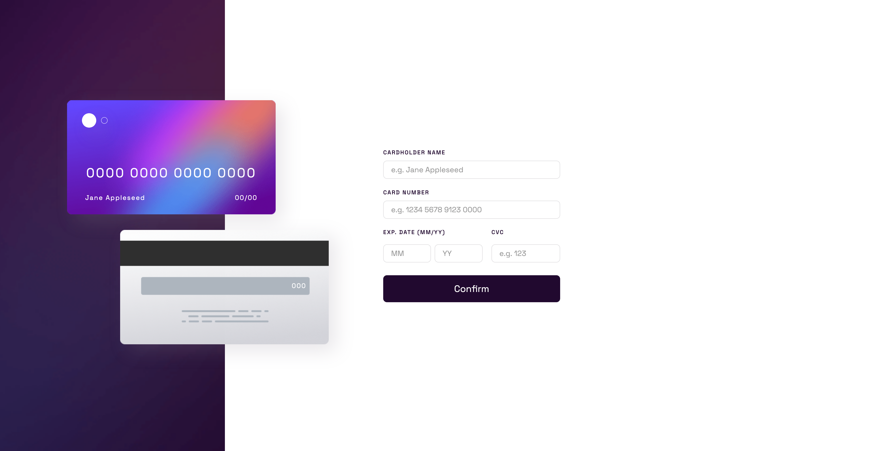

# Frontend Mentor - Interactive card details form

<br>

## Overview

Users should be able to:

- Fill in the form and see the card details update in real-time
- Immediately receive error messages if they enter incorrect data:
  - For the cardholder name field, they will be alerted if they enter numbers instead of letters.
  - For the card number field, they will be alerted if they enter letters instead of numbers.
  - For the month and year fields, they will be alerted if they enter letters or select a non-existing month.
  - For the CVC field, they will be alerted if they enter letters instead of numbers.
- Receive error messages when the form is submitted if:
  - Any input field is empty
  - The card number, expiry date, or CVC fields are in the wrong format
- View the optimal layout depending on their device's screen size
- See hover, active, and focus states for interactive elements on the page

### Built with

 &nbsp;&nbsp;
 &nbsp;&nbsp;
 &nbsp;&nbsp;


<br>

### Screenshot

<br>



### What I learned

<br>

I had a great time working on this challenging project and focused on keeping my code clean and concise. The most challenging part for me was validating the form. To overcome this, I did some research and learned about regular expressions in JavaScript. They turned out to be incredibly useful for validating data. I used regular expressions to check if the input data matched the expected patterns. This allowed me to confidently validate different types of input, such as ensuring that the cardholder name only contained letters or that the card number was numeric.

The following block of code, will return true only if the input contains letters

```js
 const regex = /[a-zA-Z\s]/;

 if (regex.test(input.value)) {
    console.log('No letters allowed');
```

This line of code will return true only if the input includes numbers

```js
 const regex = /[0-9]/;

 if (regex.test(input.value)) {
    console.log('No numbers allowed');
```

I also used the pattern attribute, which allows you to define a regular expression pattern the input must match to be valid. When the input does not match the specified pattern, an error message will be displayed to the user. Finally, with the help of .checkValidity() function, I was able to validate the input fields of the form. The .checkValidity() function allows you to check if the form data is valid according to the built-in browser validation constraints, such as the required pattern, min, max, length and type attributes you set specifically.

Example:

```html
<input
  type="text"
  name="card-number"
  id="card-number"
  placeholder="e.g. 1234 5678 9123 0000"
  maxlength="16"
  pattern="[0-9]{16}"
  required
/>
```

**_Note_**: The pattern attribute works with the following input types: text, date, search, url, tel, email, and password. Number input type would not work.
